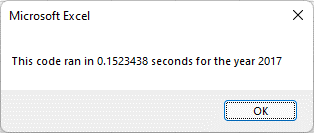
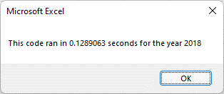

# VBA of Wall Street
Utilizing VBA to analyze stock market data for trends

## Overview of Project
VBA is a programming language used for Excel and other Microsoft programs. It provides a way to automate Excel spreadsheets to analyze large data sets. 
### Purpose
The purpose of this project is to provide the client with a convenient way to analyze stock market data to assist in data-driven market decisions. 

## Results
### Results of Stock Analysis
Overall, stocks generally did better in 2017 than they did in 2018, with a larger percentage of stocks resulting in a positive return. </br></br>

</br></br>
As the client's parents are invested in the stock DAQO ("DQ" for short), it should be noted that DQ had a very poor return in 2018, even when compared against all of the poor stock returns for the same year. While the majority of stocks analyzed had negative returns in 2018, only two of them - including DQ - had a negative return larger than -60%. In 2017, on the other hand, DQ had a very successful year when compared against other stock returns in the same time frame. With a return of +199.4% in 2017 and a return of -62.6% in 2018, DQ has proven to be a particularly volatile stock. </br></br>
If the client's parents prefer to work with a volatile stock, DQ would be a good option. If they would prefer something more stable, DQ would not be a good option. Instead, ENPH might prove more to their taste, with a return of +129.5% (2017) and +81.9% (2018).  
### Results of Refactoring Code
Refactoring the code produced the same information at greater speeds. The original code returned results for the year 2017 in 0.78125 seconds, while the refactored code returned results in 0.1523438 seconds. Similarly, the original code for the year 2018 returned results in 0.796875 seconds, while the refactored code returned results in 0.1289063 seconds. While that difference might not seem very large, it should be noted that this code was ran on a relatively small data set. On a much larger set of data, the difference between run times could potentially prove to be more impressive.</br> 
#### Refactored Code Run Times

</br>
#### Refactored vs. Original Code
The refactored code was written to provide the client with a program that could efficiently analyze larger data sets with ease. The original code required three separate passes through the data in order to obtain all values needed, while the refactored code only required one pass. This saves time and processing power. </br></br>
The loop in the original code was written as such:</br>
```
    For i = 0 To 11
        ticker = tickers(i)
        totalVolume = 0
        
            Worksheets(yearValue).Activate
            For j = 2 To RowCount
                
                If Cells(j, 1).Value = ticker Then
                    totalVolume = totalVolume + Cells(j, 8).Value
                End If
                
                If Cells(j - 1, 1).Value <> ticker And Cells(j, 1).Value = ticker Then
                    startingPrice = Cells(j, 6).Value
                End If
                
                If Cells(j + 1, 1).Value <> ticker And Cells(j, 1).Value = ticker Then
                    endingPrice = Cells(j, 6).Value
                End If
            
            Next j

        Worksheets("All Stocks Analysis").Activate
        Cells(4 + i, 1).Value = ticker
        Cells(4 + i, 2).Value = totalVolume
        Cells(4 + i, 3).Value = endingPrice / startingPrice - 1
    Next i
```
While the loop in the refactored code was written: 
```
    For i = 2 To RowCount

        tickerVolumes(tickerIndex) = tickerVolumes(tickerIndex) + Cells(i, 8).Value
        
        If Cells(i, 1).Value = tickers(tickerIndex) And Cells(i - 1, 1).Value <> tickers(tickerIndex) Then
            tickerStartingPrice(tickerIndex) = Cells(i, 6).Value
        End If
        
        If Cells(i, 1).Value = tickers(tickerIndex) And Cells(i + 1, 1).Value <> tickers(tickerIndex) Then
            tickerEndingPrice(tickerIndex) = Cells(i, 6).Value
        End If
        
        If Cells(i, 1).Value = tickers(tickerIndex) And Cells(i + 1, 1).Value <> tickers(tickerIndex) Then
            tickerIndex = tickerIndex + 1
        End If
            
    Next i

    Worksheets("All Stocks Analysis").Activate
    For i = 0 To 11
    
    Cells(4 + i, 1).Value = tickers(i)
    Cells(4 + i, 2).Value = tickerVolumes(i)
    Cells(4 + i, 3).Value = tickerEndingPrice(i) / tickerStartingPrice(i) - 1

    Next i
```
By refactoring the code in this manner, the process of looping through the data was simplified, and as a result, the total run time was shortened. This will allow the code to run on larger data sets without causing too much strain on the computer or on the client's time. 
## Summary
Refactoring code has quite a few pros and a small collection of cons. The major pros of refactoring code are that the code itself becomes much more streamlined and adaptable, and that it can run faster and more efficiently. The biggest con of refactoring code is that it can be trickier to write, especially if a coder doesn’t fully understand the parts of the code that need to be refactored, or how those parts function. </br></br>
The original code for this project was able to be run on the small data set provided, but it wasn’t as efficient as it could be. Even though the original code was easier to write, it would be a pain to have to try and adapt it for a much longer data set, and might not be able to provide the client with a good analysis in an appropriate amount of time. In this instance, the need for an efficient piece of code outweighs the desire to have an easy piece of code to write. </br></br>
The refactored code, on the other hand, was a little trickier to write. The introduction of extra references and the tickerIndex proved to be confusing at times. Still, the outcome created a much more efficient piece of code that ran in less time and could easily be applied to larger sets of data without any trouble for the client. 


