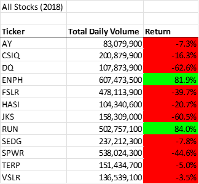
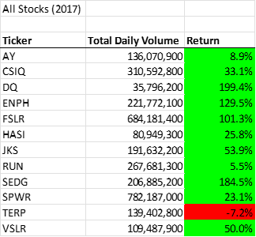

# VBA of Wall Street
Utilizing VBA to analyze stock market data for trends
## Overview of Project
VBA is a programming language used for Excel and other Microsoft programs. 
### Purpose
The purpose of this project is to provide the client with a convenient way to analyze stock market data to assist in data-driven market decisions. 
## Results
### Results of Stock Analysis* What are the results of our analysis? 
Overall, stocks generally did better in 2017 than they did in 2018, with a larger percentage of stocks resulting in a positive return. 

### Results of Refactoring Code
----->speed of original code (2017): 0.78125 s
----->speed of original code (2018): 0.796875 s
----->speed of refactored code (2017): 0.1171875 s
----->speed of refactored code (2018): 0.1210938 s
* Would this be applicable for the purpose Steve has requested? 
## Summary
* What are the advantages of refactoring code? 
* What are the disadvantages of refacotring code? 
* What are the advantages of the original VBA script? 
* What are the disadvantages of the original VBA script? 
* What are the advantages of the refactored script?
* What are the disadvantages of the refacotred script?  